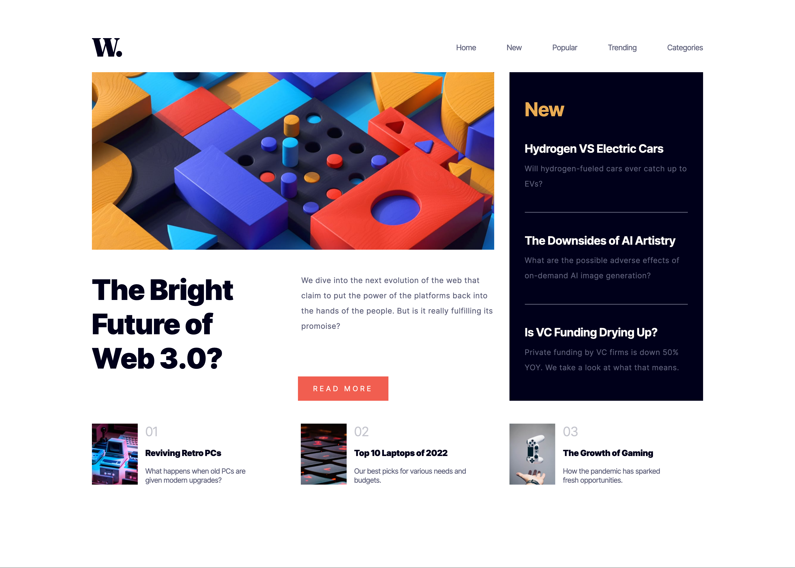
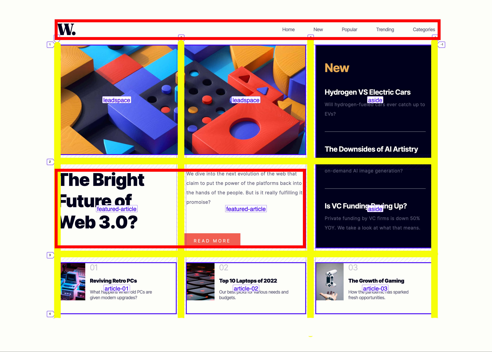

### Links

- Solution URL: [https://www.frontendmentor.io/solutions/news-homepage-css-grid-flexbox-javascript-PWM4JBtexm]
- Live Site URL: [https://user9511.github.io/frontend-mentor-news-homepage-main/]

# Frontend Mentor - News homepage solution

This is a solution to the [News homepage challenge on Frontend Mentor](https://www.frontendmentor.io/solutions/news-homepage-css-grid-flexbox-javascript-PWM4JBtexm). Frontend Mentor challenges help you improve your coding skills by building realistic projects.

## Table of contents

- [Links](#links)
- [Screenshot](#screenshot)
- [My process](#my-process)
- [Built with](#built-with)
- [What I learned](#what-i-learned)
- [Useful resources](#useful-resources)
- [Author](#author)

### Screenshot




## My process

I opened the design in Adobe Photoshop and drew a grid over it to help me visualise how I would lay out the CSS Grid. I then also drew some red boxes for sections where I would implement Flexbox.



### Built with

- Semantic HTML5 markup
- CSS custom properties
- Flexbox
- CSS Grid
- Javascript

### What I learned

I learned how to create an animated mobile repsonsive navitation menu.
I had an issue with horizontal scrolling bars appearing on my mobile view but I resolved this by using the following code:

```
header {
    overflow-x: hidden;
    max-width: 100vw;
}

and then adding this .is-active class to the header using Javascript:

 .is-active {
    overflow: visible;
}
```

This code would not allow horizontal scrolling bars to show until the .is-active class was added to the header.

### Useful resources

- [Responsive Navigation Bar Tutorial](https://www.youtube.com/watch?v=gXkqy0b4M5g) - This helped me build the responsive mobile navigation using some Javascript and CSS.

## Author

- Frontend Mentor - [@smgy94](https://www.frontendmentor.io/profile/Smgy94)
- Twitter - [@ShaneMcGeown94](https://twitter.com/ShaneMcGeown94)
- Linkedin - [@shanemcgeown](https://www.linkedin.com/in/shanemcgeown/)
